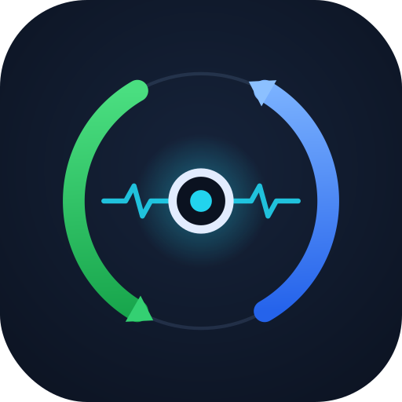
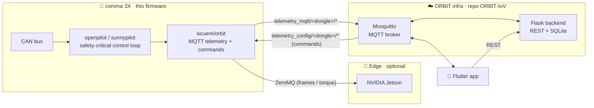

<div align="center">



# ORBITPILOT

### Onboard firmware for ORBIT — Open Remote Bidirectional IoV Telemetry

**A fork of [sunnypilot](https://github.com/sunnyhaibin/sunnypilot) / [openpilot](https://github.com/commaai/openpilot) that turns a comma 3X into a connected node of the ORBIT platform** — it streams real-time telemetry, receives remote commands, and pairs to a user account by QR, while driving stays under openpilot's own safety gates.


<br/>

<a href="https://github.com/dragoadri"></a>
&nbsp;&nbsp;&nbsp;&nbsp;<b>ft</b>&nbsp;&nbsp;&nbsp;&nbsp;
<a href="https://universidadeuropea.com"></a>

<br/>

**[Researcher profile](https://portalcientifico.universidadeuropea.com/investigadores/1299129/detalle)**
· **[Research group — SICUEM](https://portalcientifico.universidadeuropea.com/grupos/216432/detalle)**
· **[Backend + app (ORBIT-IoV) ↗](https://github.com/Dragoadri/ORBIT-IoV)**

</div>

---

## Overview

This repository is the **device side** of **ORBIT**. It runs on the car (a comma 3X) and connects the onboard driving stack to the rest of the platform. The **backend**, **mobile app**, **database** and **container stack** live in the companion repository:

> **Backend + app:** [github.com/Dragoadri/ORBIT-IoV](https://github.com/Dragoadri/ORBIT-IoV)

ORBIT externalizes non-safety-critical functionality (telemetry, remote interaction, fleet visibility) to a distributed backend and a mobile client. The safety-critical control loop remains on the vehicle; remote commands are only ever applied **through openpilot's existing actuation and safety gates** (engagement, minimum speed, blind-spot, driver override).

| Paradigm | Role on the device |
|---|---|
| **MQTT** | Real-time telemetry streaming and remote command reception |
| **ZeroMQ** | Low-latency link to an optional NVIDIA Jetson edge unit (camera frames / AI torque) |
| **openpilot / sunnypilot** | The unmodified safety-critical perception + control loop |

## ✨ What ORBIT adds on top of sunnypilot

- 📡 **Telemetry publisher** — car state, actuators, GPS, radar/lead, driving model, calibration, alerts, camera frames and logs, streamed over MQTT with a presence heartbeat.
- 🎮 **Remote command handler** — lane change, cruise-speed nudges, steering pulses, emergency braking and interval control, each bridged to the driving process via openpilot `Params`.
- 🔗 **QR device enrollment** — the device advertises a short-lived pairing code and shows a QR; the app claims it and the device binds to that account.
- 🧠 **Jetson edge integration** — ZeroMQ client for an external Jetson (image sending + AI steer-torque), selectable steer-torque modes (comma / Jetson / test / comma+Jetson obstacle avoidance).
- 🛰️ **ORBIT in-car UI** — an ORBIT-branded home screen and a driver-friendly settings menu (large, high-contrast tap targets) built on the raylib UI.

## 🏗️ Architecture



The ORBIT MQTT stack runs as threads inside the `manager` process. Because the command consumers (`controlsd`, `card`) run in **separate** processes, every remote command is bridged through openpilot `Params` (filesystem-backed), never in-process globals.

## 📁 Where the ORBIT code lives

```
ORBITPILOT/
├── sicuem/orbit/                     # the ORBIT device integration
│   ├── mqtt_envio_general.py         # telemetry publisher + heartbeat + QR enroll announce + sicuem_torque
│   ├── mqtt_comandos.py              # remote-command subscriber/router + enroll_ack
│   ├── camera_sender.py              # camera frame sender (MQTT)
│   ├── zmq_client.py                 # Jetson ZeroMQ link
│   ├── canales.json                  # telemetry channel → topic map
│   └── config_mqtt.json              # broker host/port
├── selfdrive/ui/
│   ├── layouts/home.py               # ORBIT home screen
│   ├── layouts/settings/settings.py  # driver-friendly settings menu
│   └── widgets/orbit_enroll_dialog.py# on-screen QR enrollment dialog
├── common/params_keys.h              # Orbit*/orbit_* param registrations
└── docs/superpowers/specs/           # design docs (enrollment, migration, jetson mode)
```

Everything else is upstream openpilot / sunnypilot.

## 📶 MQTT contract

Shared with the backend and app (full reference in [ORBIT-IoV](https://github.com/Dragoadri/ORBIT-IoV)).

**Telemetry — device → backend/app** (`telemetry_mqtt/<dongle>/<type>`)

| Type | Notes |
|---|---|
| `carState` | speed, cruise, blinkers, blind-spot; also the 3 s presence heartbeat |
| `carControl` · `controlsState` | actuators / hud, alerts |
| `radarState` · `drivingModelData` | lead(s), lane-line metadata |
| `liveCalibration` · `gpsLocationExternal` · `gpsLocation` | calibration, position |
| `event` · `logs` · `camera/road` | alerts, device logs, camera frames |
| `sicuem_torque` | Jetson AI steer-torque (when a Jetson mode is active) |

**Commands — backend/app → device** (`telemetry_config/<dongle>/<cmd>`)

| Command | Effect (through openpilot gates) |
|---|---|
| `left` · `right` | forced lane change |
| `control` | `forward` / `break` (speed nudge) · `tright` / `tleft` (steering pulse) |
| `speed_up` · `speed_down` · `speed_increment` | cruise-speed control |
| `overtake` | one commanded left lane change *(closed-course validation required)* |
| `brutebreak` | emergency brake (bounded intensity) |
| `intervalos` | periodic longitudinal cut demo |
| `camera_config` · `jetson_config` · `steer_torque_mode` | device configuration |
| `enroll_ack` | claim confirmation (see below) |

## 🔗 QR device enrollment

```mermaid
sequenceDiagram
    participant D as 🚗 Device (unclaimed)
    participant BR as 🔀 Broker
    participant BE as ☁️ Backend
    participant U as 📱 App (user)
    D->>D: mint pairing_code (8-char base32, TTL 600 s)
    D->>BR: telemetry_mqtt/&lt;dongle&gt;/enroll  { pairing_code, ttl_s, hw }
    BR->>BE: store pending enrollment
    D->>D: render QR  →  orbit://enroll?d=&lt;dongle&gt;&c=&lt;code&gt;
    U->>BE: POST /api/devices/claim  { dongle_id, pairing_code }
    BE->>BR: telemetry_config/&lt;dongle&gt;/enroll_ack  { claimed: true }
    BR->>D: ack  →  OrbitClaimed = true, hide QR
```

The pairing code and claimed state are exposed to the UI via the `OrbitPairingCode` / `OrbitClaimed` params. Once claimed, the QR is hidden and the device stops advertising (survives reboot).

## 🚗 Running on a comma 3X

Install like any sunnypilot build — see the sunnypilot [getting-started](https://community.sunnypilot.ai/t/getting-started-using-sunnypilot-in-your-supported-car/251) and [installation](https://community.sunnypilot.ai/t/read-before-installing-sunnypilot/254) guides. Then, for ORBIT:

1. Point `sicuem/orbit/config_mqtt.json` at your ORBIT MQTT broker (`broker` / `broker_port`).
2. Boot the device; on the home screen open **Settings → Device → Link to ORBIT** and scan the QR from the app.
3. Telemetry and remote control start flowing once the device is claimed.

## 🛠️ Development notes (this fork)

- **Working branch:** `orbit-master`.
- **Pushing:** `origin` is SSH; always push with **`git push --no-verify`**. The tracked `.lfsconfig` points Git LFS at sunnypilot's upstream GitLab (no write access), so the LFS pre-push hook must be skipped. Large LFS assets (models, sounds) are fetched read-only from that public GitLab; small ORBIT images (the logo) are kept as normal git blobs via `.gitattributes`.
- **Design docs:** `docs/superpowers/specs/` (QR enrollment, sicuem→orbit migration, comma↔Jetson mode).

## ⚠️ Safety

**Alpha-quality research software — not a product.** Remote maneuvers (lane change, overtake, speed, braking) are applied through openpilot's actuation and safety gates, but this firmware has not been through comma's safety validation. **Validate every remote-control feature on a closed course before use on the road**, and comply with local laws and regulations.

## 📚 Citation

If you use ORBIT in academic work, please cite (see [ORBIT-IoV](https://github.com/Dragoadri/ORBIT-IoV) for the canonical entry):

```bibtex
@article{orbit2026,
  title   = {ORBIT: A Scalable IoV Architecture for Remote Telemetry and Control in Open Autonomous Driving Systems},
  author  = {Ca{\~n}adas Gallardo, Adri{\'a}n and Bemposta Rosende, Sergio and Garc{\'i}a-Fern{\'a}ndez, Manuel and Aliane, Nourdine and Fern{\'a}ndez-Andr{\'e}s, Javier},
  journal = {TBD},
  year    = {2026},
  note    = {Universidad Europea de Madrid}
}
```

## 🙏 Acknowledgements

Developed within the **SICUEM** research group at **Universidad Europea de Madrid**, and built on the work of the [openpilot](https://github.com/commaai/openpilot) and [sunnypilot](https://github.com/sunnyhaibin/sunnypilot) communities.

## Licensing

ORBITPILOT is released under the [MIT License](LICENSE). This repository includes significant portions of code derived from [openpilot by comma.ai](https://github.com/commaai/openpilot) and [sunnypilot](https://github.com/sunnyhaibin/sunnypilot), also released under the MIT license with additional disclaimers.

The original openpilot license notice, including comma.ai's indemnification and alpha-software disclaimer, is reproduced below as required:

> openpilot is released under the MIT license. Some parts of the software are released under other licenses as specified.
>
> Any user of this software shall indemnify and hold harmless Comma.ai, Inc. and its directors, officers, employees, agents, stockholders, affiliates, subcontractors and customers from and against all allegations, claims, actions, suits, demands, damages, liabilities, obligations, losses, settlements, judgments, costs and expenses (including without limitation attorneys' fees and costs) which arise out of, relate to or result from any use of this software by user.
>
> **THIS IS ALPHA QUALITY SOFTWARE FOR RESEARCH PURPOSES ONLY. THIS IS NOT A PRODUCT.
> YOU ARE RESPONSIBLE FOR COMPLYING WITH LOCAL LAWS AND REGULATIONS.
> NO WARRANTY EXPRESSED OR IMPLIED.**

For full license terms, see the [`LICENSE`](LICENSE) file.
