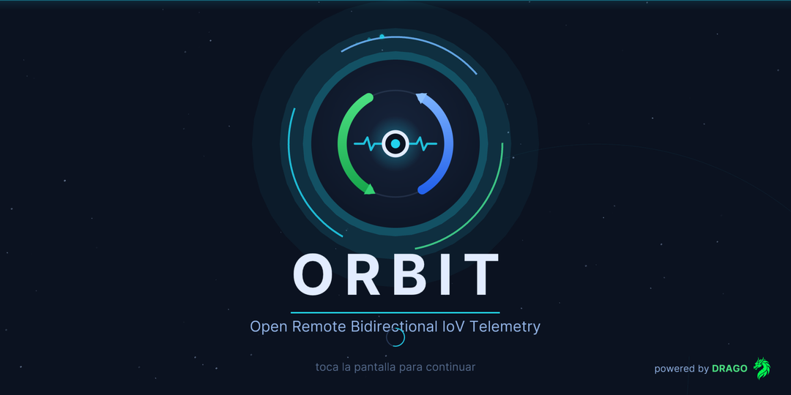
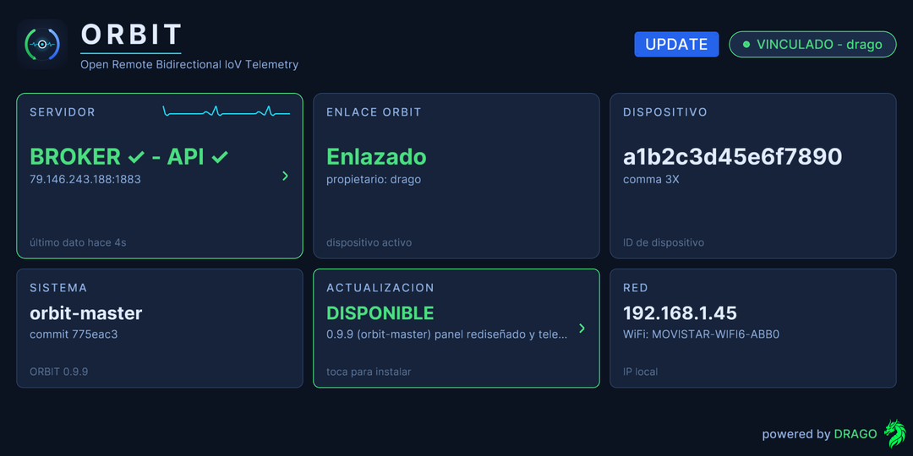
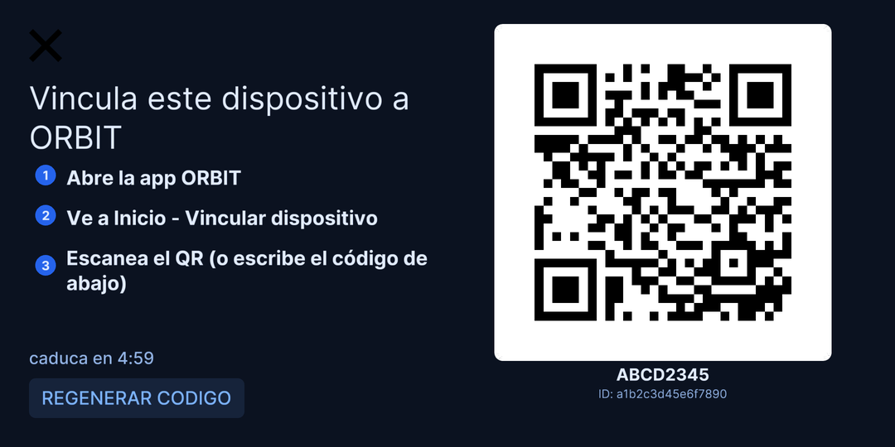
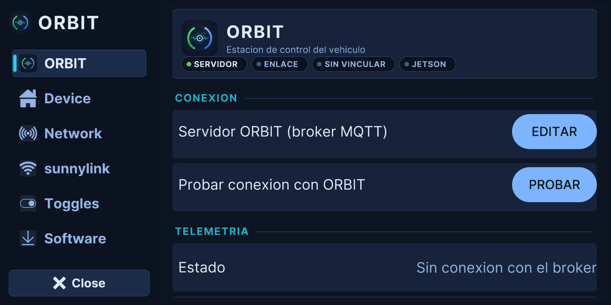
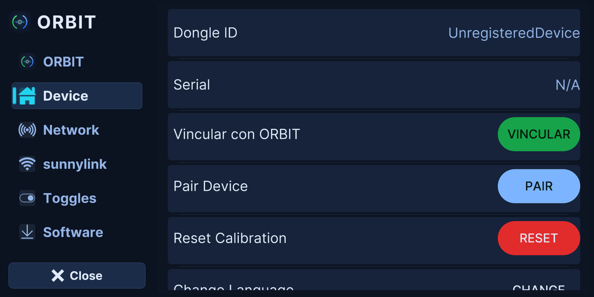
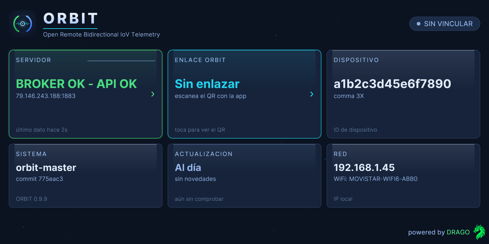
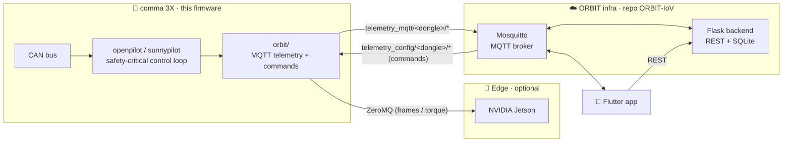
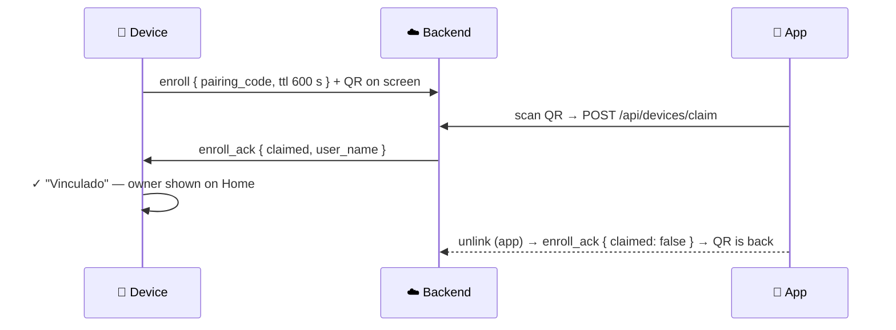

<div align="center">


# ORBITPILOT

### Onboard firmware for ORBIT — Open Remote Bidirectional IoV Telemetry

**A fork of [sunnypilot](https://github.com/sunnyhaibin/sunnypilot) / [openpilot](https://github.com/commaai/openpilot) that turns a comma 3X into a connected node of the ORBIT platform**: live telemetry out, remote commands in, QR pairing to your account — with driving always behind openpilot's own safety gates.


<br/>

<a href="https://github.com/dragoadri"></a>
&nbsp;&nbsp;&nbsp;&nbsp;<b>ft</b>&nbsp;&nbsp;&nbsp;&nbsp;
<a href="https://universidadeuropea.com"></a>

<br/>

**[Researcher profile](https://portalcientifico.universidadeuropea.com/investigadores/1299129/detalle)**
· **[Research group — SICUEM](https://portalcientifico.universidadeuropea.com/grupos/216432/detalle)**
· **[Backend + app (ORBIT-IoV) ↗](https://github.com/Dragoadri/ORBIT-IoV)**

</div>

---

## 🛰️ The in-car UI

A full dark "ground-station" redesign of the driver UI — same sunnypilot functionality, ORBIT identity.

| | | |
|:---:|:---:|:---:|
|  |  |  |
| **Boot splash** | **Home** — live broker/API status, telemetry pulse, account pill | **QR pairing** — countdown, regenerate, manual code |
|  |  |  |
| **ORBIT panel** — live status hero, connection, telemetry, Jetson | **Device** — account, unlink, calibration | **Home** — unlinked state |

## ✨ What ORBIT adds

| | |
|---|---|
| 📡 **Telemetry publisher** | car state, GPS, radar, model, alerts, camera frames → MQTT, with a 3 s heartbeat |
| 🎮 **Remote commands** | lane change, speed nudges, steering pulses, emergency brake — bridged via openpilot `Params` |
| 🔔 **On-road command overlay** | the driver *always* sees when the app sends a command; remote braking gets a full red banner |
| 🔗 **QR enrollment** | scan from the app to claim the device; owner shown in-UI; unlink from app or device |
| 🧠 **Jetson edge link** | ZeroMQ frames + AI steer-torque, live status panel, selectable torque modes |
| 🚗 **Sim + mod menu** | MetaDrive bridge with hotkey mod-menu: swap maps, spawn traffic/obstacles — test before the real car |

## 🏗️ Architecture



Backend, app, database and broker live in **[ORBIT-IoV](https://github.com/Dragoadri/ORBIT-IoV)**. The safety-critical loop never leaves the car: remote commands only act **through openpilot's actuation and safety gates**.

## 🔗 QR pairing in 10 seconds



Lost acks self-heal, codes can be regenerated from the dialog, and unlinking from the app re-opens enrollment on the device automatically.

## 🚀 Run it

1. **Install** like any sunnypilot build ([getting started](https://community.sunnypilot.ai/t/getting-started-using-sunnypilot-in-your-supported-car/251)).
2. **Point** `orbit/config_mqtt.json` at your ORBIT broker (`broker`, `broker_port`, `backend_port`).
3. **Pair**: Settings → Device → **Vincular con ORBIT** → scan with the app. Done — telemetry and remote control flow once claimed.

### 🕹️ Simulator

```bash
./tools/sim/launch_openpilot.sh          # openpilot side
./tools/sim/run_bridge.py --render       # MetaDrive side, with on-screen HUD
```

Hotkeys in the bridge terminal: `m` cycle map (loop / roundabout / intersections / highway / ramps) · `t` toggle traffic · `l`/`k` spawn lead / cut-in car · `o`/`p` obstacles · `c` clear. `./tools/sim/preview_map.py --map roundabout` previews geometry without openpilot.

<details>
<summary><b>📶 MQTT contract</b> — topics & payloads</summary>

<br/>

**Telemetry — device → cloud** (`telemetry_mqtt/<dongle>/<type>`)

| Type | Notes |
|---|---|
| `carState` | speed, cruise, blinkers, blind-spot; also the 3 s presence heartbeat |
| `carControl` · `controlsState` | actuators / hud, alerts |
| `radarState` · `drivingModelData` | lead(s), lane-line metadata |
| `liveCalibration` · `gpsLocationExternal` · `gpsLocation` | calibration, position |
| `event` · `logs` · `camera/{road,driver,wide}` | alerts, device logs, camera frames |
| `enroll` | pairing announce while unclaimed |
| `sicuem_torque` | Jetson AI steer-torque (when a Jetson mode is active) |

**Commands — cloud → device** (`telemetry_config/<dongle>/<cmd>`)

| Command | Effect (through openpilot gates) |
|---|---|
| `left` · `right` | forced lane change |
| `control` | `forward` / `break` (speed nudge) · `tright` / `tleft` (steering pulse) |
| `speed_up` · `speed_down` · `speed_increment` | cruise-speed control |
| `overtake` | one commanded left lane change *(closed-course validation required)* |
| `brutebreak` | emergency brake (bounded intensity) |
| `intervalos` | periodic longitudinal cut demo |
| `camera_config` · `jetson_config` · `steer_torque_mode` | device configuration |
| `enroll_ack` | claim / unclaim confirmation (`{claimed, user_name, user_email, ts}`) |

Every remote command is mirrored to the driver by the on-road ORBIT overlay.

</details>

<details>
<summary><b>📁 Where the ORBIT code lives</b></summary>

```
ORBITPILOT/
├── orbit/                            # the ORBIT device integration
│   ├── mqtt_envio_general.py         # telemetry publisher + heartbeat + QR enroll + connection state
│   ├── mqtt_comandos.py              # remote-command subscriber/router + enroll_ack (claim/unclaim)
│   ├── camera_sender.py              # camera frame sender (MQTT)
│   ├── zmq_client.py                 # Jetson ZeroMQ link
│   ├── canales.json                  # telemetry channel → topic map
│   └── config_mqtt.json              # broker host/port + backend port
├── selfdrive/ui/
│   ├── layouts/home.py               # ORBIT home (status cards, telemetry pulse, account pill)
│   ├── widgets/orbit_enroll_dialog.py# QR pairing dialog (countdown, regenerate, success state)
│   ├── widgets/orbit_server.py       # broker + backend health monitor
│   └── sunnypilot/onroad/orbit_command_overlay.py  # on-road remote-command indicator
├── tools/sim/                        # MetaDrive bridge + mod menu (maps, traffic, spawns)
├── common/params_keys.h              # Orbit*/orbit_* param registrations
└── docs/superpowers/specs/           # design docs (enrollment, migration, jetson mode)
```

Everything else is upstream openpilot / sunnypilot.

</details>

<details>
<summary><b>🛠️ Development notes</b> (this fork)</summary>

<br/>

- **Working branch:** `orbit-master`.
- **Pushing:** `origin` is SSH; always push with **`git push --no-verify`**. The tracked `.lfsconfig` points Git LFS at sunnypilot's upstream GitLab (read-only), so the LFS pre-push hook must be skipped. ORBIT images are plain git blobs via `.gitattributes`.
- **Design docs:** `docs/superpowers/specs/` (QR enrollment, sicuem→orbit migration, comma↔Jetson mode).

</details>

<details>
<summary><b>📚 Citation</b></summary>

```bibtex
@article{orbit2026,
  title   = {ORBIT: A Scalable IoV Architecture for Remote Telemetry and Control in Open Autonomous Driving Systems},
  author  = {Ca{\~n}adas Gallardo, Adri{\'a}n and Bemposta Rosende, Sergio and Garc{\'i}a-Fern{\'a}ndez, Manuel and Aliane, Nourdine and Fern{\'a}ndez-Andr{\'e}s, Javier},
  journal = {TBD},
  year    = {2026},
  note    = {Universidad Europea de Madrid}
}
```

</details>

## ⚠️ Safety

**Alpha-quality research software — not a product.** Remote maneuvers run through openpilot's actuation and safety gates and are always announced to the driver on screen, but this firmware has not passed comma's safety validation. **Validate every remote-control feature on a closed course first** and comply with local laws.

## 🙏 Acknowledgements & license

Developed within the **SICUEM** research group at **Universidad Europea de Madrid**, on top of [openpilot](https://github.com/commaai/openpilot) and [sunnypilot](https://github.com/sunnyhaibin/sunnypilot). Released under the [MIT License](LICENSE); the original openpilot notice is reproduced below as required:

> openpilot is released under the MIT license. Some parts of the software are released under other licenses as specified.
>
> Any user of this software shall indemnify and hold harmless Comma.ai, Inc. and its directors, officers, employees, agents, stockholders, affiliates, subcontractors and customers from and against all allegations, claims, actions, suits, demands, damages, liabilities, obligations, losses, settlements, judgments, costs and expenses (including without limitation attorneys' fees and costs) which arise out of, relate to or result from any use of this software by user.
>
> **THIS IS ALPHA QUALITY SOFTWARE FOR RESEARCH PURPOSES ONLY. THIS IS NOT A PRODUCT.
> YOU ARE RESPONSIBLE FOR COMPLYING WITH LOCAL LAWS AND REGULATIONS.
> NO WARRANTY EXPRESSED OR IMPLIED.**

For full license terms, see the [`LICENSE`](LICENSE) file.
